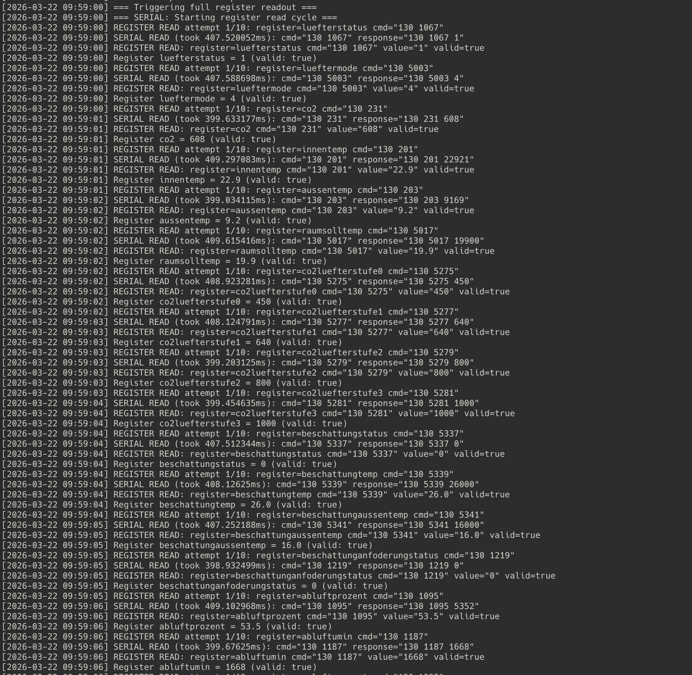
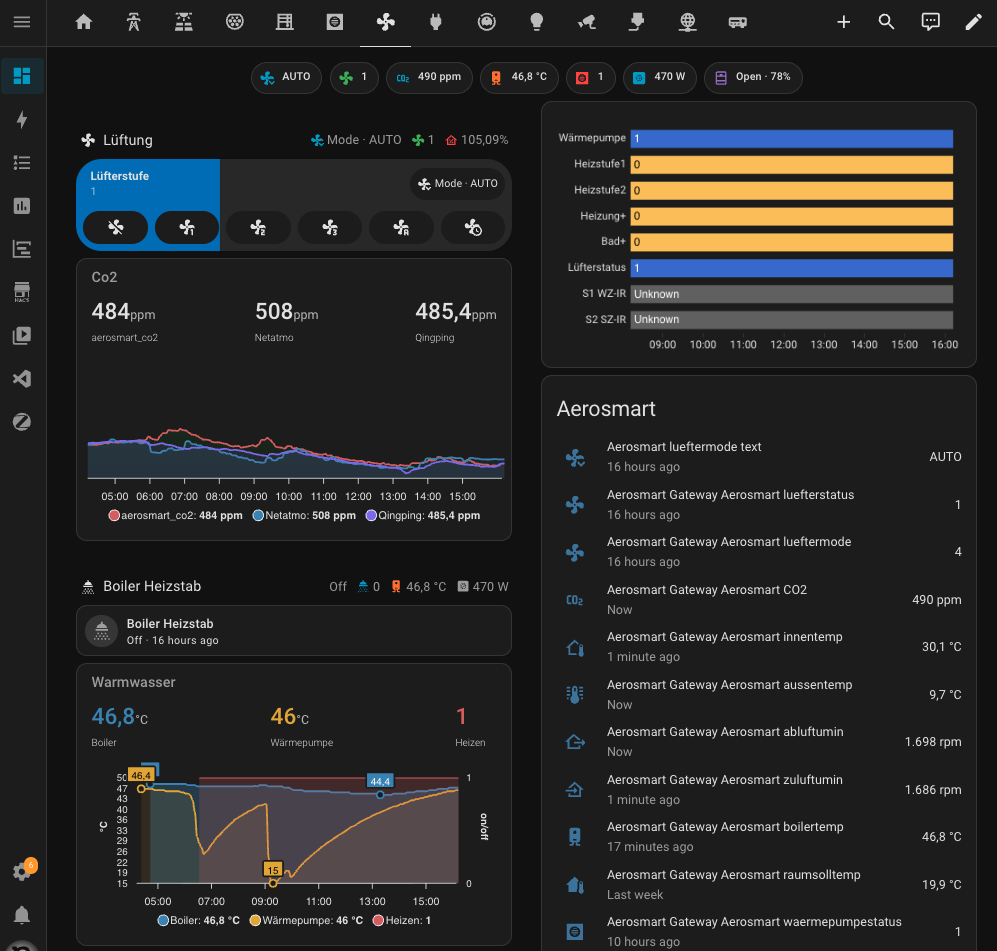

# Aerosmart Gateway

A Go-based gateway application that communicates with Drexel&Weiss Aerosmart M ventilation/heatpump devices via USB serial and integrates with Home Assistant via MQTT.

> **⚠️ Disclaimer:** This software is provided "as is", without warranty of any kind. Use at your own risk. The authors accept no liability for any damages, data loss, or device malfunctions resulting from the use of this software. This project is not affiliated with or endorsed by Drexel und Weiss.

## Features

- **Serial Communication**: Reads and writes to Aerosmart M device via serial over [USB located on Mainboard - refer to INSTALLATION.md](docs/INSTALLATION.md). NOTE: It is **NOT** Modbus RTU, no modbus settings required.
- **MQTT Integration**: Publishes sensor data and subscribes to control commands
- **MQTT Resilience**: 
  - **Persistent Session**: Subscriptions preserved across reconnects (CleanSession=false)
  - **Auto-Recovery**: Automatically re-subscribes to topics after connection loss
  - **QoS 1 Support**: At-least-once delivery for critical messages
  - **KeepAlive Monitoring**: Detects network failures within 30-60 seconds
  - **Connection State Visibility**: Logs reconnection progress and state changes
  - **Publish Retry**: Automatic retry with exponential backoff for failed publishes
- **Home Assistant Discovery**: Auto-discovers sensors and switches in Home Assistant
- **Derived Calculations**: Calculates derived values (e.g., zuluftabluftprozent, co2luefterstufe4)
- **Configurable Logging**: Supports debug, info, warn, and error log levels
- **Graceful Shutdown**: Handles SIGINT and SIGTERM signals for clean shutdown
- **Reconnection**: Automatic reconnection for both serial and MQTT connections
- **Write Priority**: Control commands preempt ongoing read operations for low-latency response (<1 second detection, 1-3 second write completion)
- **Message Deduplication**: Prevents processing duplicate MQTT messages within 1 second window
- **Timing Metrics**: Logs message processing latency (receive → process → complete) for monitoring

## Architecture

The application follows a layered architecture with the following main components:

```
┌─────────────────────────────────────────────────────────────────┐
│                        main.go                                  │
│  - Initialization & Configuration                               │
│  - Connection Management                                        │
│  - Main Loop (Periodic Reads)                                   │
└─────────────────────────────────────────────────────────────────┘
        │                     │                     │
        ▼                     ▼                     ▼
┌───────────────┐   ┌─────────────────┐   ┌───────────────┐
│   serial/     │   │    mqtt/        │   │   registers/  │
│   serial.go   │   │    client.go    │   │   reader.go   │
│               │   │                 │   │               │
│ - Open/Close  │   │ - Connect       │   │ - ReadSingle  │
│ - Write       │   │ - Publish       │   │ - ReadAll     │
│ - Read        │   │ - Subscribe     │   │ - PublishAll  │
│ - SendAnd     │   │ - Discovery     │   │               │
│   Receive     │   │                 │   │               │
└───────────────┘   └─────────────────┘   └───────────────┘
        │                     │                     │
        │                     │                     │
        └─────────────────────┼─────────────────────┘
                              ▼
                    ┌─────────────────┐
                    │   registers/    │
                    │   reader.go     │
                    │   (Writer)      │
                    │ - HandleMessage │
                    │ - TriggerFull   │
                    └─────────────────┘
```

### Component Flow

1. **Serial Port** (`internal/serial/serial.go`): Handles all serial communication with the device, including retry logic and port management
2. **MQTT Client** (`internal/mqtt/client.go`): Manages MQTT connections, publishing, and subscriptions
3. **Register Reader** (`internal/registers/reader.go`): Reads register values from the device and publishes to MQTT
4. **Register Writer** (`internal/registers/reader.go`): Handles write commands from MQTT and verifies after writing

## Quick Start

### Prerequisites

- Go 1.25 or later
- A serial device connected to your Aerosmart M ventilation system
- MQTT broker (e.g., Mosquitto)

### Installation

```bash
# Clone the repository
git clone https://github.com/nean/aerosmart-gateway.git
cd aerosmart-gateway

# Build the application
go build -o aerosmart-gateway ./cmd/main.go
```

### Configuration

1. Copy the example configuration file:

```bash
cp config/config.yaml.example config.yaml
```

2. Edit `config.yaml` with your settings:

```yaml
serial:
  port: "/dev/ttyUSB0"
  baudrate: 115200

mqtt:
  broker: "192.168.1.20"
  port: 1883
  username: "mqtt"
  password: "your_password"
  client_id: "aerosmart-gateway"

device_id: "aerosmart"
log_level: "debug"
read_interval: 60

ha_discovery:
  enabled: true
```

### Running the Application

```bash
./aerosmart-gateway -config config.yaml -registers registers.yaml
```
Example of full register readout:


## Documentation

For detailed information about the application flow and timing diagrams, see:

- [Application Flow Analysis](docs/APPLICATION_FLOW.md) - Detailed analysis of the application flow
- [Timing Diagrams](docs/TIMING_DIAGRAMS.md) - Visual timing diagrams of component interactions
- [Installation Guide](docs/INSTALLATION.md) - Detailed setup instructions

## Command Line Options

| Option | Description | Default |
|--------|-------------|---------|
| `-config` | Path to config file | `config.yaml` |
| `-registers` | Path to registers file | `registers.yaml` |
| `-version` | Show version information | `false` |

## Configuration Options

### Serial Configuration

| Option | Description | Default |
|--------|-------------|---------|
| `serial.port` | Serial device path | `/dev/ttyUSB0` |
| `serial.baudrate` | Baud rate | `115200` |
| `serial.read_timeout` | Read timeout (ms, 0=200ms fallback) | `1` |
| `serial.device_response_delay` | Wait after write (ms) | `40` |
| `serial.max_retries` | Max operation retries | `10` |
| `serial.max_reopens` | Max port reopen attempts | `10` |

### MQTT Configuration

| Option | Description | Default |
|--------|-------------|---------|
| `mqtt.broker` | MQTT broker address | `localhost` |
| `mqtt.port` | MQTT broker port | `1883` |
| `mqtt.username` | MQTT username | - |
| `mqtt.password` | MQTT password | - |
| `mqtt.client_id` | Client identifier | `aerosmart-gateway` |
| `mqtt.qos` | Quality of Service (0, 1, or 2) | `0` |
| `mqtt.retain` | Retain messages | `true` |
| `mqtt.publish_retry_count` | Number of retries for failed publishes | `3` |
| `mqtt.connect_retry_initial_delay_ms` | Initial delay for exponential backoff | `500ms` |
| `mqtt.connect_retry_max_delay_ms` | Maximum delay for exponential backoff | `30000ms` |
| `mqtt.connect_retry_jitter_percent` | Jitter percentage for backoff | `25%` |

> **MQTT Resilience Note:** The gateway uses QoS 1 (at-least-once delivery) for subscriptions and publishes to ensure message reliability. Persistent sessions (CleanSession=false) preserve subscriptions across reconnects. KeepAlive is set to 30 seconds for fast disconnect detection.

### Application Configuration

| Option | Description | Default |
|--------|-------------|---------|
| `device_id` | Device identifier | `aerosmart` |
| `log_level` | Logging level | `debug` |
| `read_interval` | Read interval (seconds) | `60` |
| `ha_discovery.enabled` | Enable HA discovery | `true` |

## MQTT Topics

### Read Registers (Published)

The gateway publishes sensor values to the following topics:

- `aerosmart/luefterstatus` - Fan status (0-5)
- `aerosmart/lueftermode` - Fan mode (0-5)
- `aerosmart/co2` - CO2 level (ppm)
- `aerosmart/innentemp` - Indoor temperature (°C)
- `aerosmart/aussentemp` - Outdoor temperature (°C)
- `aerosmart/raumsolltemp` - Room setpoint temperature (°C)
- `aerosmart/zuluftumin` - Supply air RPM
- `aerosmart/abluftumin` - Exhaust air RPM
- `aerosmart/zuluftprozent` - Supply air percentage (%)
- `aerosmart/abluftprozent` - Exhaust air percentage (%)
- `aerosmart/zuluftsollvolumenstrom` - Supply air setpoint (m³/h)
- `aerosmart/abluftsollvolumenstrom` - Exhaust air setpoint (m³/h)
- And more... (see registers.yaml)

### Write Registers (Subscribed)

The gateway subscribes to the following topics for device control:

- `dw/aerosmart/luefterstufe` - Set fan stage (0-5) - *Topic changes detected and processed within 1-3 seconds*
- `dw/aerosmart/boilerheizstab` - Set boiler heating element (0-1) - *Topic changes detected and processed within 1-3 seconds*

> **Note:** The gateway implements immediate message detection with atomic write priority signaling, ensuring control commands are processed with minimal latency. See [MQTT Message Delay Fix](docs/MQTT_MESSAGE_DELAY_FIX.md) for technical details.

### Derived Registers

The gateway calculates and publishes derived values:

- `aerosmart/zuluftabluftprozent` - Supply/Exhaust percentage
- `aerosmart/co2luefterstufe4` - CO2 fan stage 4 (calculated from stage 3)
- `aerosmart/beschattungtemp_adjusted` - Adjusted shading temperature

## Home Assistant Integration

When `ha_discovery.enabled` is set to `true`, the gateway automatically publishes discovery configurations to Home Assistant. This creates:

- **Sensors**: For all read registers (temperature, CO2, fan speed, etc.)
- **Switches**: For write registers (fan stage, boiler heating element)

The devices will appear in Home Assistant with the name "Aerosmart Gateway".

Example of Home Assistant dashboard:



## Application Flow

### Initialization

1. Load configuration from config.yaml
2. Load register definitions from registers.yaml
3. Initialize logger
4. Connect to serial device (with retry)
5. Connect to MQTT broker (with retry)
6. Publish Home Assistant discovery configs
7. Subscribe to write register topics
8. Start periodic read loop

### Periodic Read Cycle

1. Timer fires every N seconds (configurable)
2. Writer checks for write priority (if write pending, skip read)
3. Reader reads all configured registers sequentially
4. Each register: Send command → Read response → Parse → Validate → Publish to MQTT
5. Wait for next timer interval

### Write Operation

1. MQTT message received on write topic
2. Writer signals write priority (cancels ongoing read)
3. Parse and validate value
4. Send command to device
5. Read response and verify
6. Read verify registers (if configured)
7. Publish verified values to MQTT

### Retry Logic

The application implements comprehensive retry logic:

- **Connection Retry**: Exponential backoff with jitter for both serial and MQTT
- **Serial Retry**: Write and read retries with port reopening on failure
- **Max Retries**: Configurable maximum attempts before giving up
- **MQTT Publish Retry**: Failed publishes are retried with exponential backoff (1s, 2s, 4s)
- **MQTT KeepAlive**: Detects network failures within 30-60 seconds for fast reconnection
- **Subscription Recovery**: Automatically re-subscribes to all topics after connection is restored

## Running as a Service

### systemd (Linux)

Create a systemd service file at `/etc/systemd/system/aerosmart.service`:

```ini
[Unit]
Description=Aerosmart Gateway - Connects Aerosmart ventilation to MQTT
After=network.target
Wants=network.target

[Service]
Type=simple
User=root
ExecStart=/opt/aerosmart/aerosmart-gateway -config /opt/aerosmart/config.yaml -registers /opt/aerosmart/registers.yaml
Restart=on-failure
RestartSec=5

[Install]
WantedBy=multi-user.target
```

Then enable and start the service:

```bash
sudo systemctl daemon-reload
sudo systemctl enable aerosmart
sudo systemctl start aerosmart
```


## Development

### Running Tests

```bash
go test ./...
```

### Building with Docker

```dockerfile
FROM golang:1.25-alpine AS builder
WORKDIR /app
COPY go.mod go.sum ./
RUN go mod download
COPY . .
RUN go build -o aerosmart-gateway ./cmd/main.go

FROM alpine:latest
RUN apk --no-cache add ca-certificates
WORKDIR /app
COPY --from=builder /app/aerosmart-gateway .
COPY config.yaml .
COPY registers.yaml .
CMD ["./aerosmart-gateway", "-config", "config.yaml", "-registers", "registers.yaml"]
```

### Code Linting

```bash
golangci-lint run
```

## Registers Configuration

The `registers.yaml` file defines:

- **Read Registers**: Values to read from the device
- **Write Registers**: Values that can be written to the device
- **Derived Registers**: Calculated values based on read registers

Each register has:
- `name`: Unique identifier
- `command`: Serial command to send
- `topic`: MQTT topic for publishing/subscribing
- `divisor`: Value divisor (for float conversion)
- `type`: Value type (integer or float)
- `min_value` / `max_value`: Valid range
- `ha`: Home Assistant configuration

## License

This project is licensed under the GNU General Public License v3.0 - see the [LICENSE](LICENSE) file for details.

## Acknowledgments

- Serial communication library: [tarm/serial](https://github.com/tarm/serial)
- MQTT client library: [eclipse/paho.mqtt.golang](https://github.com/eclipse/paho.mqtt.golang)
